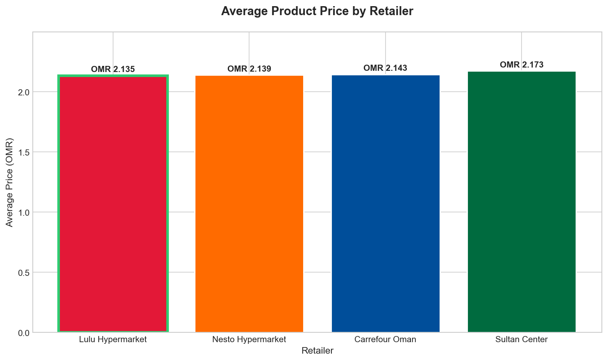
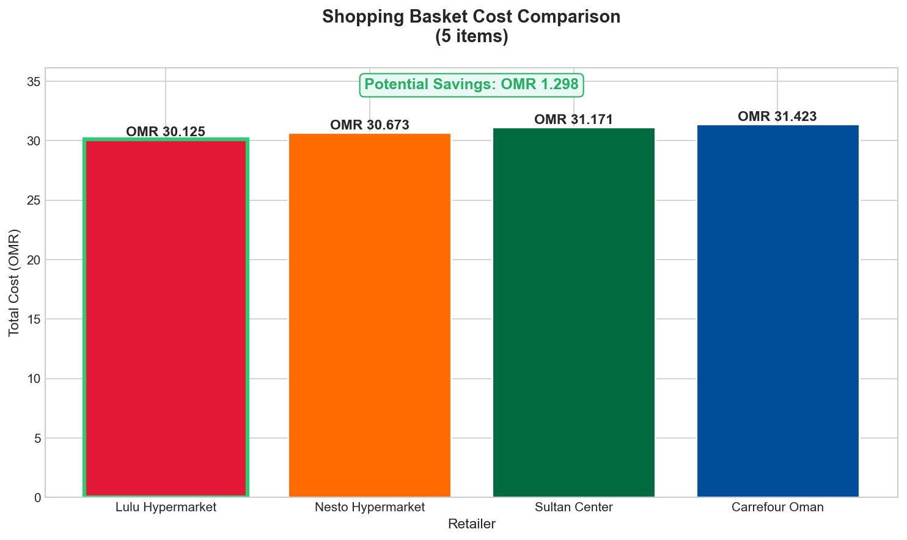
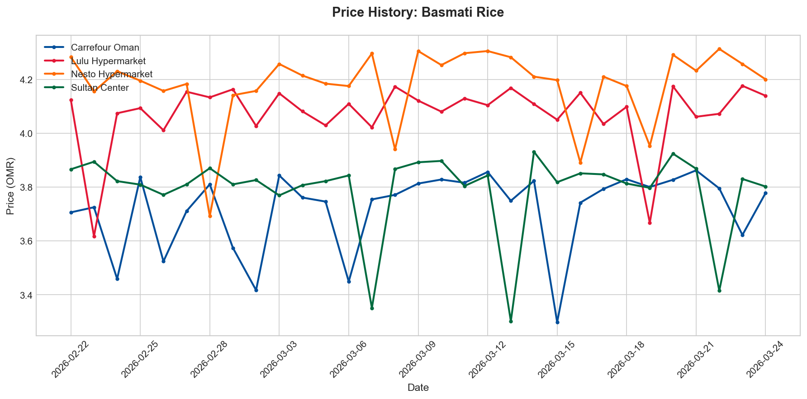
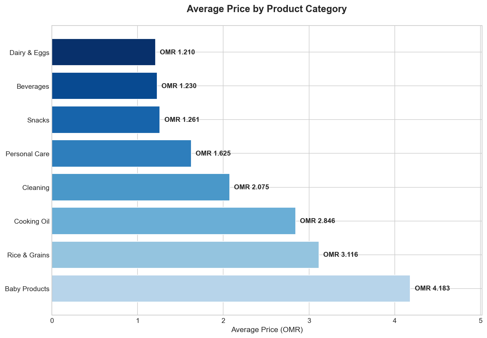
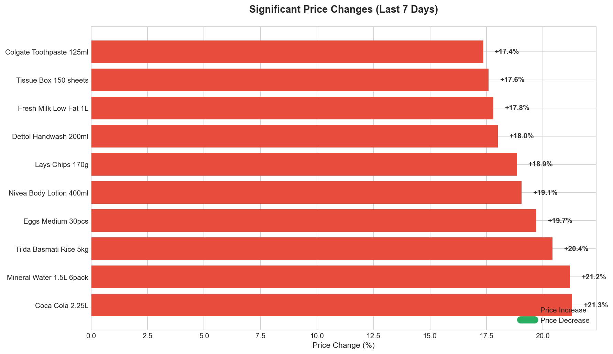

# Oman Retail Price Intelligence System

A Python-based price intelligence platform that tracks and compares retail prices across major Omani supermarkets including **Lulu Hypermarket**, **Carrefour**, **Sultan Center**, and **Nesto**.

## Features

- **Price Comparison**: Compare prices across all major Oman retailers
- **Consumer Savings Advisor**: Input your shopping list, get the cheapest store
- **Price Change Detection**: Identify significant price increases/decreases
- **Inflation Tracking**: Monitor price trends over time
- **Category Analysis**: Analyze pricing by product category
- **Visual Reports**: Auto-generated charts for insights

## Quick Start

```bash
# Clone the repository
git clone https://github.com/yourusername/oman-retail-price-intelligence.git
cd oman-retail-price-intelligence

# Install dependencies
pip install -r requirements.txt

# Run everything
python main.py --all
```

## Usage

```bash
python main.py --help          # Show all options
python main.py --generate      # Generate sample price data
python main.py --analyze       # Run price analysis
python main.py --advisor       # Run Consumer Savings Advisor
python main.py --visualize     # Generate charts
python main.py --find "Rice"   # Find cheapest store for a product
python main.py --all           # Run all features
```

---

## Sample Analysis Output

### Price Analysis Report

```
==================================================
PRICE ANALYSIS REPORT
==================================================

--- Summary Statistics ---
Products Tracked: 44
Price Records: 5456
Retailers: 4
Data Range: 2026-02-22 to 2026-03-24

--- Store Comparison ---
Retailer                     Avg Price   Products
--------------------------------------------------
Lulu Hypermarket          OMR   2.135         44
Nesto Hypermarket         OMR   2.139         44
Carrefour Oman            OMR   2.143         44
Sultan Center             OMR   2.173         44

Cheapest Overall: Lulu Hypermarket
Most Expensive: Sultan Center
Price Spread: OMR 0.038

--- Category Analysis ---
Category                Avg Price   Products
---------------------------------------------
Baby Products        OMR   4.183          5
Rice & Grains        OMR   3.116          6
Cooking Oil          OMR   2.846          5
Cleaning             OMR   2.075          5
Personal Care        OMR   1.625          5
Snacks               OMR   1.261          5
Beverages            OMR   1.230          6
Dairy & Eggs         OMR   1.210          7

--- Recent Price Changes (Last 7 Days) ---
  Coca Cola 2.25L                UP 21.3%
  Mineral Water 1.5L 6pack       UP 21.2%
  Tilda Basmati Rice 5kg         UP 20.4%
  Eggs Medium 30pcs              UP 19.7%
  Nivea Body Lotion 400ml        UP 19.1%

--- Inflation Analysis (30 Days) ---
Average Price Change: 0.89%
Annualized Rate: 10.83%
```

### Consumer Savings Advisor Output

```
==================================================
CONSUMER SAVINGS ADVISOR
==================================================

Your Shopping List (5 items):
  - Basmati Rice
  - Sunflower Oil
  - Fresh Milk
  - Eggs
  - Cheddar Cheese

--- Store Comparison ---
Store                            Total  Items Found
----------------------------------------------------
Lulu Hypermarket          OMR  30.125         11/5
Nesto Hypermarket         OMR  30.673         11/5
Sultan Center             OMR  31.171         11/5
Carrefour Oman            OMR  31.423         11/5

>>> RECOMMENDATION: Shop at Lulu Hypermarket to save OMR 1.298
>>> Potential Savings: OMR 1.298
```

### Find Cheapest Store Output

```
--- Finding Cheapest: Pampers ---

Product: Pampers Diapers Size 4 64pcs
Cheapest: Nesto Hypermarket at OMR 6.172
Most Expensive: Lulu Hypermarket at OMR 6.965
Savings: OMR 0.793 (11.4%)

All Prices:
  Nesto Hypermarket         OMR 6.172
  Sultan Center             OMR 6.556
  Carrefour Oman            OMR 6.708
  Lulu Hypermarket          OMR 6.965
```

---

## Visualizations

### Store Comparison
Shows which retailer has the lowest average prices across all tracked products.



### Consumer Savings Advisor
Compare your shopping basket cost across all stores with potential savings highlighted.



### Price History
Track price trends for any product over time across all retailers.



### Category Analysis
Average prices broken down by product category.



### Price Changes
Detect significant price increases (red) and decreases (green) in the last 7 days.



---

## Customization Guide

### How to Add a New Retailer

Edit `config.py` and add to the `RETAILERS` dictionary:

```python
RETAILERS = {
    "lulu": {
        "name": "Lulu Hypermarket",
        "base_url": "https://www.luluhypermarket.com/en-om",
        "currency": "OMR"
    },
    # ADD NEW RETAILER HERE:
    "new_store": {
        "name": "Your Store Name",
        "base_url": "https://www.store-website.com",
        "currency": "OMR"
    }
}
```

Then add a color for charts in `src/visualizer.py`:

```python
self.colors = {
    "lulu": "#E31837",
    "carrefour": "#004E9A",
    "sultan_center": "#006B3F",
    "nesto": "#FF6B00",
    "new_store": "#9B59B6"  # ADD COLOR HERE
}
```

### How to Add New Products

Edit `src/data_generator.py` and add to the `PRODUCTS` dictionary:

```python
PRODUCTS = {
    "Rice & Grains": [
        {"name": "India Gate Basmati Rice 5kg", "base_price": 4.500, "unit": "5kg"},
        # ADD NEW PRODUCT HERE:
        {"name": "Your Product Name", "base_price": 2.500, "unit": "1kg"},
    ],
    # ADD NEW CATEGORY HERE:
    "New Category": [
        {"name": "Product 1", "base_price": 1.000, "unit": "1pc"},
        {"name": "Product 2", "base_price": 2.000, "unit": "500g"},
    ]
}
```

Then regenerate data:
```bash
python main.py --generate
```

### How to Add New Categories

Edit `config.py` and add to the `CATEGORIES` list:

```python
CATEGORIES = [
    "Rice & Grains",
    "Cooking Oil",
    "Dairy & Eggs",
    "Beverages",
    "Snacks",
    "Personal Care",
    "Cleaning",
    "Baby Products",
    "New Category"  # ADD HERE
]
```

### How to Change the Shopping List

Edit `main.py` in the `run_consumer_advisor()` function:

```python
def run_consumer_advisor():
    # MODIFY THIS LIST:
    shopping_list = [
        "Basmati Rice",
        "Sunflower Oil",
        "Fresh Milk",
        "Eggs",
        "Cheddar Cheese"
    ]
```

Or edit `src/visualizer.py` in `generate_all_charts()`:

```python
def generate_all_charts(self, shopping_list: List[str] = None):
    if shopping_list is None:
        # MODIFY DEFAULT LIST HERE:
        shopping_list = ["Basmati Rice", "Sunflower Oil", "Fresh Milk", "Eggs"]
```

### How to Change Price Change Threshold

Edit `config.py`:

```python
# Change from 5% to any threshold you want
PRICE_CHANGE_THRESHOLD = 0.05  # 5% = significant change
PRICE_CHANGE_THRESHOLD = 0.10  # 10% = only major changes
PRICE_CHANGE_THRESHOLD = 0.02  # 2% = more sensitive
```

---

## Project Structure

```
oman-retail-price-intelligence/
├── main.py                 # CLI entry point
├── config.py               # Configuration (retailers, categories, settings)
├── requirements.txt        # Python dependencies
├── src/
│   ├── __init__.py
│   ├── analyzer.py         # Price analysis logic
│   ├── data_generator.py   # Sample data & product definitions
│   └── visualizer.py       # Chart generation & colors
├── data/
│   └── prices.db           # SQLite database
└── assets/
    └── *.png               # Generated charts
```

## File Reference

| File | What to Edit |
|------|--------------|
| `config.py` | Retailers, categories, thresholds |
| `src/data_generator.py` | Products and base prices |
| `src/visualizer.py` | Chart colors and styles |
| `main.py` | Default shopping list |

---

## Technical Details

- **Database**: SQLite for portable data storage
- **Visualization**: Matplotlib for professional charts
- **Currency**: Omani Rial (OMR)
- **Data**: 44 products, 4 retailers, 30 days of price history

## Future Enhancements

- [ ] Live web scraping from retailer websites
- [ ] Price alerts via email/SMS
- [ ] Weekly automated reports
- [ ] Mobile app integration
- [ ] Arabic language support

## License

MIT License

## Author

Ahmed - Data Analyst Portfolio Project
